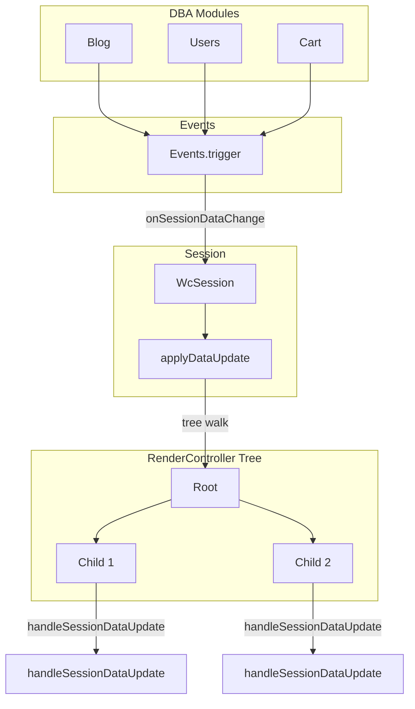

# Migration Plan: From Delegates/Data Sources to Props-Based Pattern

## Overview

This is a phased refactor to replace delegate patterns, data sources, and data updates with a
unified props-based system in the `people-post/pp-app` repository. The goal is to enable 1:1
relationships, support reactive data updates, and ensure long-term maintainability. Agents
should be able to "pickup from leftovers" by reading this plan and marking progress.

See [Data Flow](#data-flow) for how session data propagates through the system.

## Key Changes

- Replace `setDelegate` with callback props (e.g., `onClickInCareerFragment`).
- Replace `setDataSource` with a `data` prop.
- Enhance `handleSessionDataUpdate` with an `onDataUpdate` reactive callback prop.
- Unify into a `setProps` method per component.

## Instructions for Agents

- Always read this file (`MIGRATION_PLAN.md`) to understand the current phase and progress.
- For "continue the plan on next phase", read the plan, identify the next incomplete phase, and implement it.
- After completing a phase, update this file with progress (e.g., check off the phase and add notes on changes).
- Ensure changes are backward-compatible during transition.

---

## Data Flow



**Current flow**: DBA modules call `Events.trigger(dataType, data)` when data changes. WcSession (the Events delegate) receives `onSessionDataChange` and calls `applyDataUpdate` on the root RenderController. `RenderController.applyDataUpdate` walks the tree depth-first, calling `handleSessionDataUpdate` on each node.

**handleSessionDataUpdate vs onDataUpdate**:
- `handleSessionDataUpdate`: The *receiver* — a component overrides this to react to *global* session data (e.g., user profile, cart, notifications). Data flows down the tree via the applyDataUpdate walk.
- `onDataUpdate` (in props): For *child-to-parent* — the parent passes a callback so the child can notify the parent of *local* data changes. Example: parent passes `onDataUpdate: (data) => this.reload(data)` in setProps. These serve different directions and can coexist.

---

## Component Inventory

| Category            | Count | Examples                                   |
| ------------------- | ----- | ------------------------------------------ |
| Blog                | ~25   | FPost, FArticle, FPostInfo, FArticleEditor |
| Cart                | ~8    | FCart, FCartItem, FvcCurrent               |
| Shop                | ~20   | FProduct, FvcProductEditor                  |
| Workshop            | ~15   | FvcProject, FvcProjectEditor                |
| HR/User             | ~10   | FvcUserInfo, FUserInfo                     |
| Lib                 | ~15   | Button, FLongList, FScrollableHook         |
| Auth, Session, etc. | ~50+  | Various                                    |

---

## Progress Tracker

- [x] **Phase 1**: Setup Base Infrastructure and Plan Tracker *(completed)*
- [x] **Phase 2a**: Refactor Simple Components — FCareer, FArticle (parent-facing only) *(completed)*
- [ ] **Phase 2b**: Complete FArticle internals and FPost
- [ ] **Phase 3**: Enhance Data Updates and Reactive Props
- [ ] **Phase 4**: Refactor Complex Components (FCart, FvcUserInfo)
- [ ] **Phase 5**: Integration Testing and Cleanup
- [ ] **Phase 6**: Library Components *(optional)*

---

## Phase 1: Setup Base Infrastructure and Plan Tracker

**Status**: Complete

**Goals**:
- Create this `MIGRATION_PLAN.md` file in the repo root with the full plan, phases, and a
  progress tracker.
- Add comments in `Controller.ts` linking to this file.
- Child classes define and manage their own `AgentProps` interface (with `data`, `callbacks`,
  and `onDataUpdate`) and their own `setProps`/`getProps` methods independently, without
  requiring changes to the `Controller` base class.

**Concrete Usage Example** (replacing the old FCareer delegate/dataSource wiring):

```ts
// Before (legacy pattern):
const career = new FCareer();
career.setDataSource(myDataSource);   // implements FCareerDataSource
career.setDelegate(myDelegate);        // implements FCareerDelegate

// After (props-based pattern, Phase 1 foundation):
// FCareer defines its own props interface and setProps/getProps methods:
interface FCareerProps {
  data?: { roleId: string };
  callbacks?: { onClickInCareerFragment?: (f: unknown) => void };
  onDataUpdate?: (data: unknown) => void;
}

// class FCareer extends Controller {
//   private _props: FCareerProps | null = null;
//   setProps(props: FCareerProps): void { this._props = props; }
//   getProps(): FCareerProps | null { return this._props; }
// }

const career = new FCareer();
career.setProps({
  data: { roleId: "engineer" },
  callbacks: {
    onClickInCareerFragment: (f: unknown) => handleCareerClick(f as FCareer),
  },
  onDataUpdate: (data) => career.reload(data),
});
```

**Files Changed**:
- `MIGRATION_PLAN.md` (created — this file)
- `src/lib/ext/Controller.ts` (updated — added comment linking to this file)

---

## Phase 2a: Refactor Simple Components (FCareer, FArticle parent-facing)

**Status**: Complete

**Goals**:
- Refactor `FCareer.ts` and `FArticle.ts` to use `setProps` instead of delegates/data sources
  for *parent-to-child* wiring.
- Remove interfaces like `FCareerDelegate` and `FArticleDelegate`.
- Update usages in parent components.

**Changes Made**:
- `src/common/hr/FCareer.ts`: Replaced `FCareerDelegate`/`FCareerDataSource` interfaces with
  `FCareerProps` interface. Added `setProps`/`getProps` methods. Updated `action()` and
  `_renderOnRender()` to use props callbacks. Kept `setRoleId`/`getRoleId` as convenience
  methods (delegating to `_props.data.roleId`).
- `src/sectors/blog/FArticle.ts`: Replaced `FArticleDelegate`/`FArticleDataSource` interfaces
  with `FArticleProps` interface. Added `setProps`/`getProps` methods. Updated
  `onSimpleButtonClicked()` to use `_props.callbacks.onTagClickedInArticleFragment`.
- `src/sectors/blog/FCareerList.ts`: Updated `FCareer` instantiation to use `setProps`.
- `src/sectors/workshop/FvcCareerList.ts`: Updated `FCareer` instantiation to use `setProps`.
- `src/sectors/shop/FvcCareerList.ts`: Updated `FCareer` instantiation to use `setProps`.
- `src/sectors/blog/FPost.ts`: Updated `FArticle` instantiation to use `setProps` instead of
  `setDelegate`.

---

## Phase 2b: Complete FArticle Internals and FPost

**Status**: Pending

**Goals**:
- Migrate remaining delegate/dataSource usage inside FArticle and FPost.
- Remove all `setDelegate`/`setDataSource` from these components.

**Remaining Work**:

| File | Remaining Usage | Action |
|------|-----------------|--------|
| `src/sectors/blog/FArticle.ts` | fGallery.setDataSource/setDelegate, fQuote.setDelegate, tag Buttons in #renderTags | Add props for FGallery, FQuoteElement; pass callbacks for tag clicks via FSimpleFragmentList or Button props |
| `src/sectors/blog/FPost.ts` | FSocialBar.setDataSource/setDelegate, Button.setDelegate, FFeedArticleInfo.setDelegate, FJournalIssue | Add props to FSocialBar, Button; migrate FFeedArticleInfo, FJournalIssue to setProps |

**Completion Criteria**: No `setDelegate` or `setDataSource` calls in FArticle.ts or FPost.ts.

---

## Phase 3: Enhance Data Updates and Reactive Props

**Status**: Pending

**Goals**:
- Clarify and document the relationship between `handleSessionDataUpdate` and `onDataUpdate`.
- Add optional `onDataUpdate` to component props where parent needs to react to child data changes.

**Key Points**:
- `handleSessionDataUpdate` stays as the tree-walk mechanism. Components that need to react to
  global session data override it. No change to this flow.
- `onDataUpdate` in props is for *child-to-parent* local updates. Pattern: parent passes
  `onDataUpdate: (data) => this.reload(data)` in setProps; child calls it when local data changes.
- **Account.ts**: When Account is used as data source for a component, that component should
  eventually receive data via props instead of delegate. Defer detailed Account migration until
  RenderController tree migration is further along.

---

## Phase 4: Refactor Complex Components

**Status**: Pending

**Goals**:
- Update FCart, FCartItem, FvcUserInfo and related components to use props instead of delegates/data sources.
- AgentChain: Deferred to a future phase until design is defined.

**Files to Migrate** (dependency order):

1. **FCartItem** (leaf): `src/sectors/cart/FCartItem.ts`
2. **FCart**: `src/sectors/cart/FCart.ts`
3. **FvcCurrent**, **FvcPreCheckout**: `src/sectors/cart/FvcCurrent.ts`, `src/sectors/shop/FvcPreCheckout.ts`
4. **FUserInfoHeroBanner**: `src/sectors/hr/FUserInfoHeroBanner.ts`
5. **FvcOwnerPosts**, **FvcOwner** (workshop/shop), **FvcUserCommunity**: various
6. **FvcUserInfo**: `src/sectors/hr/FvcUserInfo.ts`

---

## Phase 5: Integration Testing and Cleanup

**Status**: Pending

**Goals**:
- Add tests for props and handoff.
- Remove old delegate code from Controller base.
- Manual smoke tests for critical flows (blog post, cart, user info).

**Controller Base Deprecation**:
- Remove `setDelegate`/`setDataSource` from `Controller.ts` only after all components in the
  tree no longer use them.
- Step 1: Add `@deprecated` JSDoc to `setDelegate` and `setDataSource` in Controller.
- Step 2: After migration is complete, remove the methods and `_delegate`/`_dataSource` fields.

---

## Phase 6: Library Components (Optional)

**Status**: Pending

**Goals**:
- Decide whether to migrate lib components (Button, FLongList, FScrollableHook, FDateSelector,
  etc.) or keep them as-is.
- Lib components are used by many app components. Options:
  - Migrate lib components last, after app components.
  - Keep lib components as-is; only migrate parent wiring (parent passes props, lib component
    may still use internal delegate pattern for its own children).

---
