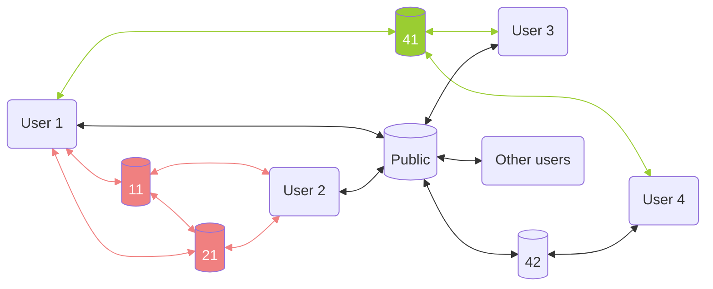

# frontend

## Directory layout

| Name                         | Description                                                                                |
|------------------------------|--------------------------------------------------------------------------------------------|
| ext/                         | 3rd party codes                                                                            |
| img/                         | Static images                                                                              |
| doc/                         | Documents                                                                                  |
| css/                         | Css styling files                                                                          |
| app/                         | Main javascript source code folder                                                         |
| sw/                          | Service worker source code folder                                                          |
| html/                        | Entry files                                                                                |
| package.sh                   | Packaging script to compile code and prepare package                                       |

## Design
### Connections


## Web3 file structures
<details>
  <summary>Root file</summary>

Root file holds everything about a user's public information
```
{
  "version": "1.0",
  "profile": {
    "nickname": "",
    "icon_cid": "",
    "brief_introduction": ""
  },
  "posts": "<cid of post list file>",
  "idols": "<cid of idol list file>",
  "marks": "<cid of mark map file>"
}
```
Fields:
- `version`: For software backward compatiblity.
- `profile`: Basic user profile like name, brief introduction, icon, banner image etc. 
- `posts`: Cid of file containing user's posts.
- `idols`: Cid of file containing user ids followed by current user.
- `marks`: Cid of file containing user's interations with other users.

</details>

<details>
  <summary>Index files</summary>

#### Purpose
Index files are used when referring to mulitple items. Special considerations are needed when the total number of items are expected to grow large over time.
The purpose is to improve loading performance on client side.

#### Item content definition
A item is a relatively small json dict which may contain a file cid referring to the full content.

#### List based indexing
##### Spec
- Item order
  - Reverse chronological.
- Short list
  - Plain json array of items.
- Long list
  - Bottom items shall automatically "fold" into sub index files.
  - Sub index file shall hold limited items, the limit can be set from either a fixed time span(e.g. a month) or a fixed number(e.g. 1k~10k).
  - Sub index file along with the timestamp of the lastest item inside becomes the item content in master list.
  - Timestamp can help time based search.

##### Example
```
{
    "posts": [{
        "timestamp" : 1746741377,
        "type": "ARTICLE",
        "cid": "QmRo5R6cCMcuekniEbV5QjRoqJnvAcDSxEVppisHPcndMR"
    }, {
        "timestamp" : 1746741367,
        "type": "ARTICLE",
        "cid": "QmR1hzM9jJYPH4Yp8P22d1VkLErPpCbdHjJBmRaASPYN4j"
    }, {
        "timestamp" : 1746741357,
        "type": "_IDX",
        "cid": "QmQNyYkptGh7v7KK8o4qZ8gEbo2LAEwWASuVzrrhUS8U6C"
    }]
}
```

#### Map based indexing
##### Spec
- Key for item
  - A string
- Small map
  - Plain json key-value pair
- Large map
  - Keys are grouped by their two bytes.
  - Each key group refers to the cid of sub map file.
  - Fixed split threshold (e.g. 1k~10k).
  - Sub map file can further split when items exceeds threshold, same rule except keys are grouped by next two bytes.
  - Dynamically transforms into map of maps when number exceeds limit.

##### Example
```
{
  "marks": {
      "00" : "<cid of sub map file>",
      "ab" : "<cid of sub map file>",
      ...
      "xy" : "<cid of sub map file>"
  }
}
```
</details>

<details>
<summary>Posts</summary>

#### Post list file structure
```
{
    "posts": [{
        "type": "ARTICLE",
        "cid": "QmRo5R6cCMcuekniEbV5QjRoqJnvAcDSxEVppisHPcndMR"
    }, {
        "type": "ARTICLE",
        "cid": "QmR1hzM9jJYPH4Yp8P22d1VkLErPpCbdHjJBmRaASPYN4j"
    }]
}
```
#### Article file structure
The first cid above ("QmRo5R6cCMcuekniEbV5QjRoqJnvAcDSxEVppisHPcndMR") is linked to following article content:
```
{
    "title": "「众议院议长凯文·麦卡锡被罢免」专稿",
    "content": "10月1日，麦卡锡争取民主党支持以通过临时支出法案，被指违背了年初当选议长时与党内极端保守派谈妥的条件。10月4日 Matt Gaetz 等共和党议员提出罢免麦卡锡众议院议长的动议...",
    "attachments": [{
        "type": "application/pdf",
        "cid": "QmVa3vtWrkCZkivJ6FNzeEYbtwh59Ffu5fyW1iLXbxthdA"
    }]
}
```
Finally, the attachment cid ("QmVa3vtWrkCZkivJ6FNzeEYbtwh59Ffu5fyW1iLXbxthdA") is linked to a pdf file in IPFS.

#### Upadting process
The updating process is in reverse order:
1. use `<dataserver>/api/file/upload` to upload necessary attachments and get their cids. The API is one file per call.
2. use `<dataserver>/api/json/upload` to upload articles that include necessary attachment file cids. The API is one json per call, returning json file cid.
3. use `<dataserver>/api/json/upload` to upload article index file that has articles id lists. The API return is the index file cid, note this cid should repalce old cid inside the file in next step.
4. use `<dataserver>/api/json/upload` to upload final entry json file and get its cid, note this cid should replace old cid as entry file.
5. use `<dataserver>/api/pin/update` to unpin old cids and pin new cids.
6. finally use `<nameserver>/api/pin/publish` to publish the latest entry file cid
</details>

<details>
  <summary>Idols</summary>

#### Idol list file structure
Ordered by the time when follow action happened reverse chronologically.
```
{
    "idols": [{
        "type": "USER",
        "id": "<idol user id>",
        "nickname": "<nickname from user's perspective>",
    }, {
        "type": "USER",
        "id": "",
        "nickname": "",
    }]
}
```
- `type`:
  - `USER`: A normal user account
- `id`: Id of the target
- `nickname`: Nickname for personalized display
</details>

<details>
  <summary>Marks</summary>

#### Map file structure
Key: marked item cid

```
{
  "marks": {
    "<item_cid>": {
      "like": true,
      "comments": [{
        "type": "AUDIO",
        "cid": "<audio file cid>"
      }, {
        "type": "REQUEST",
        "cid": "<request file cid>"
      }, {
        "type": "ARTICLE",
        "cid": "<article file cid>"
      }]
    }
  }
}
```
Type:
- `AUDIO`: Audio reply.
- `ARTICLE`: Same format as a normal article post.
- `REQUEST`: Preformatted request messages.

TODO: Redesign? e.g. Embed AUDIO into ARTICLE, move REQUEST to new category like "tasks".

</details>
