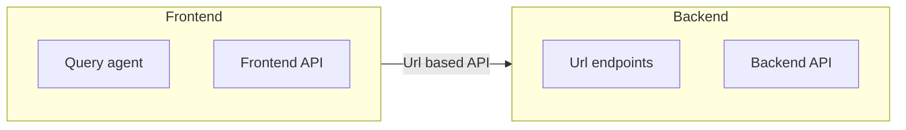

# Architecture

This document is a Markdown representation of `doc/architecture.dia`.

## Overview

- **Frontend**
  - **Query agent**
  - **Frontend API**
- **Backend**
  - **Url endpoints**
  - **Backend API**
- **Integration**
  - Frontend calls Backend via **Url based API**

## Diagram (Mermaid)

