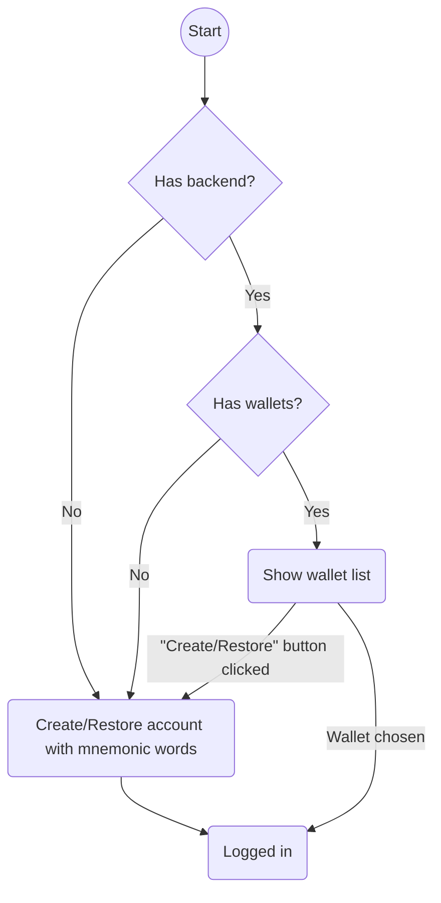

```mermaid
graph TD;
    START((Start)) --> HAS_BACKEND@{ shape: diamond, label: "Has backend?" };
    HAS_BACKEND -- No --> CREATE_ACCOUNT(Create/Restore account with mnemonic words);
    HAS_WALLETS -- No --> CREATE_ACCOUNT;
    HAS_BACKEND -- Yes --> HAS_WALLETS@{ shape: diamond, label: "Has wallets?" };
    HAS_WALLETS -- Yes --> WALLET_LIST(Show wallet list);
    WALLET_LIST -- #quot;Create/Restore#quot; button clicked --> CREATE_ACCOUNT;
    WALLET_LIST -- Wallet chosen --> LOGGED_IN(Logged in);
    CREATE_ACCOUNT --> LOGGED_IN;
```
