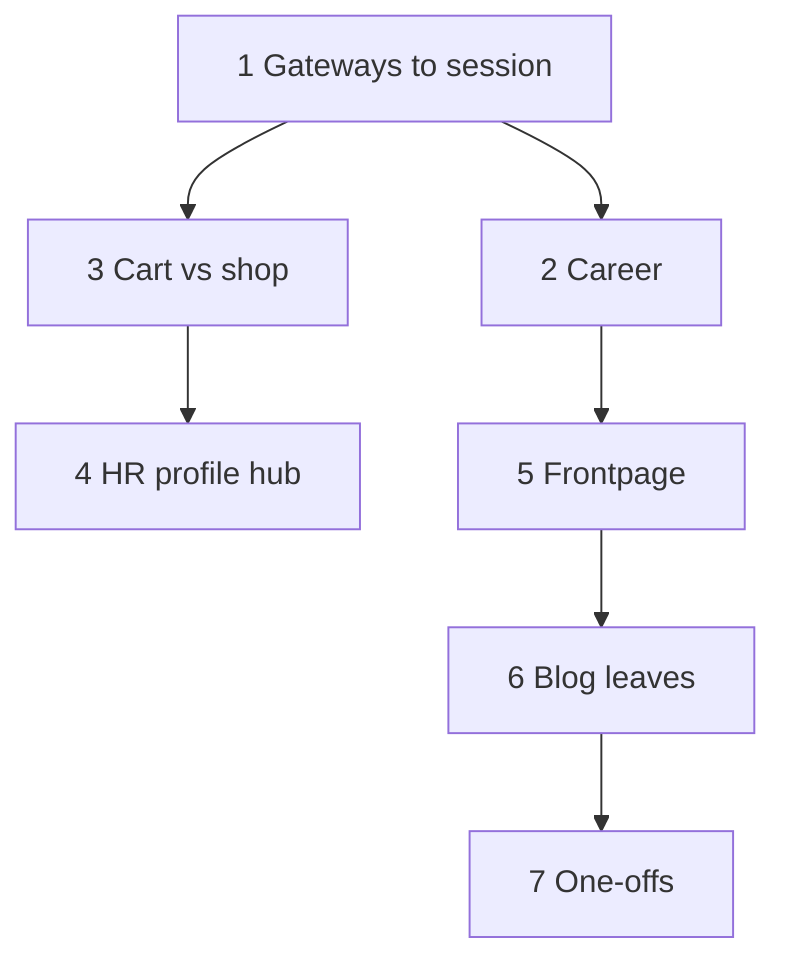

# Plan: Fix Cross-Sector Dependency Violations

This document captures the remediation plan for violations reported by `npm run check-deps` (sector cross-imports between different folders under `src/sectors/`). It aligns with the layering rules in [ComponentRelationships.md](./ComponentRelationships.md).

**Guardrails:**

- Sector folders are **islands**: no imports from sibling `src/sectors/<other>/`.
- **Shared code** → `src/common` (or lower layers).
- **Cross-sector wiring** → `src/session` (especially `session/Gateway.ts`).
- Do **not** use lazy/dynamic imports only to hide cycles.

**Verification:** After each batch, run `npm run check-deps`. Before finishing work, run `npm run build` (per `AGENTS.md`). When complete, update §2 in `ComponentRelationships.md` to note zero sector cross-deps.

---

## Baseline (as of plan authoring)

- **Layer ordering:** clean (`No layer violations found.`).
- **Sector cross-deps:** 38 edges (see `npm run check-deps` output for exact file:line list).

---

## Workstream 1 — Sector `Gateway.ts` files (`hr`, `pseudo`)

**Violations**

- `hr/Gateway.ts` imports `FvcCareerList` from **blog**, **workshop**, and **shop**.
- `pseudo/Gateway.ts` imports **shop** queue/counter views.

**Approach**

These files act as **composition roots in the wrong layer**. Move or mirror behavior into **`src/session/Gateway.ts`** (or a dedicated `session/*Gateway*.ts` helper) so session chooses which sector view to mount. Sector gateways should only reference **their own folder** plus `common` / `lib`, or be removed if session fully subsumes them.

**Why first:** Establishes the pattern for other hubs and avoids rework.

---

## Workstream 2 — Career triangle (`hr` ↔ `blog` / `shop` / `workshop`)

**Violations**

- `blog/FCareerList.ts` → `hr/FvcCareer.ts`
- `shop/FvcCareerList.ts`, `workshop/FvcCareerList.ts` → `hr/FvcCareer.ts`
- (Plus `hr/Gateway` once workstream 1 is done.)

**Approach**

- Keep **owned career domain** in one place: `FvcCareer` in **hr**, *or* move shared **contracts/types** to `src/common` if HR is not the sole owner.
- Sector-specific list chrome can stay per sector **without** importing `hr` if **session** passes factories/controllers registered at bootstrap, or if **`common`** holds shared list building blocks.

**Pragmatic shape:** `common` for career-related **types and small UI**; **hr** for `FvcCareer`; cross-sector list wiring via **session** (with workstream 1).

---

## Workstream 3 — Cart ↔ Shop

**Violations (7 edges)**

| # | From | To | Site |
|---|------|----|------|
| 1 | `shop/FvcExplorer` | `cart/FvcCurrent` | cart-button click → show cart view |
| 2 | `shop/FvcMain` | `cart/FvcCurrent` | URL-param `?addon=cart` → show cart view |
| 3 | `shop/FvcOwner` | `cart/FvcCurrent` | cart-button click → show cart view |
| 4 | `shop/FvcPreCheckout` | `cart/FCart` | counter checkout embeds cart display |
| 5 | `shop/FvcPreCheckout` | `cart/FvcCheckout` | counter checkout navigates to checkout |
| 6 | `cart/FCartItem` | `shop/FvcProduct` | product name click → show product detail |
| 7 | `cart/FvcCurrent` | `auth/Gateway` | checkout while unauthenticated → show login |

---

### Group A — `cart/FvcCurrent` → `auth/Gateway` (violation 7)

**Root cause:** `FvcCurrent#goCheckout()` directly instantiates `AuthGateway` to produce a login `View` when the user is not authenticated.

**Fix — auth facade in `common/plt`:**

1. Create **`src/common/plt/AuthFacade.ts`** with a static registration API:
   ```ts
   let _factory: (() => View) | null = null;
   export const AuthFacade = {
     register(factory: () => View): void { _factory = factory; },
     createLoginView(): View | null { return _factory ? _factory() : null; },
   };
   ```
2. In **`session/Gateway.ts`** init (before any cart view is mounted), register the factory:
   ```ts
   import { AuthFacade } from '../common/plt/AuthFacade.js';
   import { Gateway as AuthGateway } from '../sectors/auth/Gateway.js';
   AuthFacade.register(() => new AuthGateway().createLoginView());
   ```
3. In **`cart/FvcCurrent.ts`**, replace:
   ```ts
   import { Gateway as AuthGateway } from '../auth/Gateway.js';
   // …
   let gw = new AuthGateway();
   let v = gw.createLoginView();
   ```
   with:
   ```ts
   import { AuthFacade } from '../../common/plt/AuthFacade.js';
   // …
   let v = AuthFacade.createLoginView();
   ```

**Files:** `common/plt/AuthFacade.ts` *(new)*, `cart/FvcCurrent.ts`, `session/Gateway.ts`

---

### Group B — `cart/FCartItem` → `shop/FvcProduct` (violation 6)

**Root cause:** `FCartItem#onProductClicked()` constructs a `FvcProduct` view directly and passes it to its delegate.

**Fix — delegate protocol extension (no new common file needed):**

1. **`cart/FCartItem.ts`** — extend the local `CartItemDelegate` interface with a new method and update `#onProductClicked`:
   ```ts
   interface CartItemDelegate {
     // existing methods …
     onCartItemFragmentRequestShowProduct(f: FCartItem, productId: string): void;
   }
   // In #onProductClicked:
   #onProductClicked(productId: string): void {
     this._delegate.onCartItemFragmentRequestShowProduct(this, productId);
   }
   ```
   Remove `import { FvcProduct }` and `import { View }` (if no longer needed).

2. **`cart/FCart.ts`** — `FCart` is `FCartItem`'s delegate. Add the implementation and forward via its own delegate:
   ```ts
   // Add to CartDelegate interface:
   onCartFragmentRequestShowProduct(f: FCart, productId: string): void;
   // Implement CartItemDelegate:
   onCartItemFragmentRequestShowProduct(_f: FCartItem, productId: string): void {
     this._delegate.onCartFragmentRequestShowProduct(this, productId);
   }
   ```

3. **`cart/FvcCurrent.ts`** — `FvcCurrent` is `FCart`'s delegate. Add:
   ```ts
   onCartFragmentRequestShowProduct(_f: FCart, productId: string): void {
     this._owner?.onCartCurrentFragmentRequestShowProduct?.(this, productId);
   }
   ```

4. **`shop/FvcPreCheckout.ts`** — also a `FCart` delegate. Add:
   ```ts
   onCartFragmentRequestShowProduct(_f: FCart, productId: string): void {
     this._owner?.onPreCheckoutFragmentRequestShowProduct?.(this, productId);
   }
   ```

5. **Session / composition layer** — wherever `FvcCurrent` or `FvcPreCheckout` is mounted, implement the `onCartCurrentFragmentRequestShowProduct` / `onPreCheckoutFragmentRequestShowProduct` owner callbacks by creating a `FvcProduct` view from `sectors/shop`.

**Files:** `cart/FCartItem.ts`, `cart/FCart.ts`, `cart/FvcCurrent.ts`, `shop/FvcPreCheckout.ts`, session composition file(s)

---

### Group C — `shop/{FvcExplorer,FvcOwner,FvcMain}` → `cart/FvcCurrent` (violations 1–3)

**Root cause:** All three shop view-fragments contain the same 3-line pattern to show the cart:
```ts
let v = new View();
let f = new FvcCurrent();
v.setContentFragment(f);
this._owner?.onFragmentRequestShowView?.(this, v, "Cart");
```

**Fix — cart facade in `common/plt`:**

1. Create **`src/common/plt/CartFacade.ts`** (mirrors the auth facade shape):
   ```ts
   let _factory: (() => View) | null = null;
   export const CartFacade = {
     register(factory: () => View): void { _factory = factory; },
     createCartView(): View | null { return _factory ? _factory() : null; },
   };
   ```
2. In **`session/Gateway.ts`** init, register the factory:
   ```ts
   import { CartFacade } from '../common/plt/CartFacade.js';
   import { FvcCurrent } from '../sectors/cart/FvcCurrent.js';
   CartFacade.register(() => {
     let v = new View();
     v.setContentFragment(new FvcCurrent());
     return v;
   });
   ```
3. In each of **`shop/FvcExplorer.ts`**, **`shop/FvcOwner.ts`**, **`shop/FvcMain.ts`**: replace the 3-line pattern with:
   ```ts
   import { CartFacade } from '../../common/plt/CartFacade.js';
   // …
   let v = CartFacade.createCartView();
   if (v) this._owner?.onFragmentRequestShowView?.(this, v, "Cart");
   ```
   Remove `import { FvcCurrent }` from all three files.

**Files:** `common/plt/CartFacade.ts` *(new)*, `shop/FvcExplorer.ts`, `shop/FvcOwner.ts`, `shop/FvcMain.ts`, `session/Gateway.ts`

---

### Group D — `shop/FvcPreCheckout` → `cart/FCart` + `cart/FvcCheckout` (violations 4–5)

**Root cause:** `FvcPreCheckout` is a counter/register flow owned by shop UX but implemented by directly composing cart-sector UI (`FCart`, `FvcCheckout`). It is created inside `shop/FWalkinQueueItem#goCheckout()`, so `shop` becomes a composition root for another sector.

**Decision:** treat pre-checkout as **cross-sector composition**, therefore move the composition root to `session` (the only layer allowed to wire sectors together).

**Solid migration plan (2 commits)**

**Commit D1 — Introduce session-owned composer (behavior preserved):**

1. **Add** `session/composition/FvcPreCheckout.ts` by moving existing `shop/FvcPreCheckout.ts` implementation with minimal edits:
   - Keep class name and public API (`setCart`, delegate callbacks, render behavior) unchanged.
   - Only adjust relative import paths.
2. In the new file, add one narrow owner callback contract for product navigation (if Group B is already applied):
   ```ts
   onPreCheckoutFragmentRequestShowProduct?(f: FvcPreCheckout, productId: string): void;
   ```
   and forward from `onCartFragmentRequestShowProduct`.
3. Keep old `shop/FvcPreCheckout.ts` temporarily as a shim:
   ```ts
   export { FvcPreCheckout as default, FvcPreCheckout } from '../../session/composition/FvcPreCheckout.js';
   ```
   This keeps runtime stable while the caller chain is rewired.

**Commit D2 — Rewire ownership and remove shop dependency:**

1. **`shop/FWalkinQueueItem.ts`**
   - Remove direct import of `FvcPreCheckout`.
   - Add delegate method:
     ```ts
     onWalkinQueueItemRequestCheckout?(f: FWalkinQueueItem, cart: CartDataType): void;
     ```
   - Replace `#goCheckout(cart)` body with delegate dispatch:
     ```ts
     this._delegate?.onWalkinQueueItemRequestCheckout?.(this, cart);
     ```
2. **Find concrete owner chain** (required, no guessing):
   - Start from `FWalkinQueueItem.setDelegate(...)`.
   - Follow to parent list/controller in shop.
   - Continue until the top-level session-mounted owner is reached.
3. In the first owner that is already in `session` (or is allowed to import `session/composition`), implement:
   ```ts
   onWalkinQueueItemRequestCheckout(_f, cart): void {
     let v = new View();
     let f = new FvcPreCheckout(); // from session/composition
     f.setCart(cart);
     v.setContentFragment(f);
     Events.triggerTopAction(T_ACTION.SHOW_DIALOG, this, v, "Checkout");
   }
   ```
4. Remove the temporary shim `shop/FvcPreCheckout.ts` once no references remain.

**Acceptance criteria for Group D**

- `rg "sectors/cart/(FCart|FvcCheckout)" src/sectors/shop` returns no matches.
- `rg "FvcPreCheckout" src/sectors/shop` only finds type names or delegate contracts, not instantiation/import from shop.
- Counter checkout still opens dialog, preserves item quantity edits, and reaches checkout screen.
- `npm run check-deps` shows violations 4 and 5 removed.
- `npm run build` succeeds.

**Rollback-safe checkpoints**

- After D1: app behavior unchanged (shim in place), build must pass.
- After D2: run one manual smoke test (`walk-in queue -> checkout dialog -> checkout view`) before removing shim.

**Files:** `session/composition/FvcPreCheckout.ts` *(new via move)*, `shop/FWalkinQueueItem.ts`, one or more session composition owners, then delete shim `shop/FvcPreCheckout.ts`

---

### Execution order within Workstream 3

```
A (auth facade)   ──┐
                    ├──► C (cart facade, independent of A/B)
B (product nav)   ──┤
                    └──► D (move FvcPreCheckout, depends on B being done first
                              so FvcPreCheckout's FCart delegate is already updated)
```

Concretely:
1. **Group A** — two files + one new file; run `npm run check-deps` (−1 edge).
2. **Group C** — two files + one new file; run `npm run check-deps` (−3 edges).
3. **Group B** — four files + session wiring; run `npm run check-deps` (−1 edge).
4. **Group D** — file move + delegate; run `npm run check-deps` (−2 edges).

After all four groups: 7 edges removed. Run `npm run build` to verify.

---

## Workstream 4 — HR profile hub (`FvcUserInfo`, `FvcWeb3UserInfo`)

**Violations**

- `hr` → **blog**, **workshop**, **shop**, **community**, **messenger** (multiple imports).

**Approach**

Highest fan-out; avoid leaving direct cross-sector imports.

- **Tab/panel registry:** `session` (or a `common` registry **type**) holds entries `{ id, createPanel }` registered per sector at bootstrap; hr UI iterates registered factories only.
- Alternatively, split so hr renders **slots** filled by **session** composition.

Same theme as gateways: **hr = shell; session attaches sector bodies.**

---

## Workstream 5 — Frontpage ↔ Blog

**Violations**

- `frontpage/FvcBrief.ts`, `FvcJournal.ts` → blog loaders, lists, scroller.

**Approach**

- Move **reusable** loaders/list pieces to **`src/common`** if generic.
- If **blog-specific**, **`sectors/frontpage` must not import `sectors/blog`**: compose frontpage layout + blog widgets in **`session`** (or a frontpage path owned by session).

---

## Workstream 6 — Blog leaf violations

| File | Cross-sector | Approach |
|------|----------------|----------|
| `blog/AbWeb3New.ts` | → **hosting** (`FvcWeb3ServerRegistration`) | Shared “new post + server registration” in **common**, or registration only in **session** / **hosting** route. |
| `blog/FQuoteElement.ts` | → **shop**, **workshop** | Quote/product/project resolution: **common** types/helpers, or **session**-provided render callbacks when building blog content. |
| `blog/FCareerList.ts` | → **hr** | Covered in workstream 2. |

---

## Workstream 7 — Smaller one-offs

| From | To | Approach |
|------|-----|----------|
| `account/FvcBasic.ts` | `auth/FvcChangePassword` | Move/password UI to **account**, shared **common**, or compose from **session**. |
| `cart/FCartItem.ts` | `shop/FvcProduct` | Product display in **common**, or product view factory injected from **session**. |
| `shop/FBranch.ts` | `account/FvcAddressEditor` | Address editor in **`src/common`** or session-provided component. |
| `shop/FvcCounterMain.ts` | `auth/Gateway` | **Session** / **common** auth facade (gateway pattern). |

---

## Suggested execution order

1. Workstream 1 (session + sector gateways)
2. Workstreams 2 and 3 in parallel once 1 clarifies composition
3. Workstream 4 (registry / slots for profile hub)
4. Workstreams 5–6 (frontpage, blog)
5. Workstream 7 (one-offs)

Dependency sketch:



---

## After completion

- `npm run check-deps` exits 0 with no sector violations.
- Update **§2 Current Status** in `ComponentRelationships.md`.
