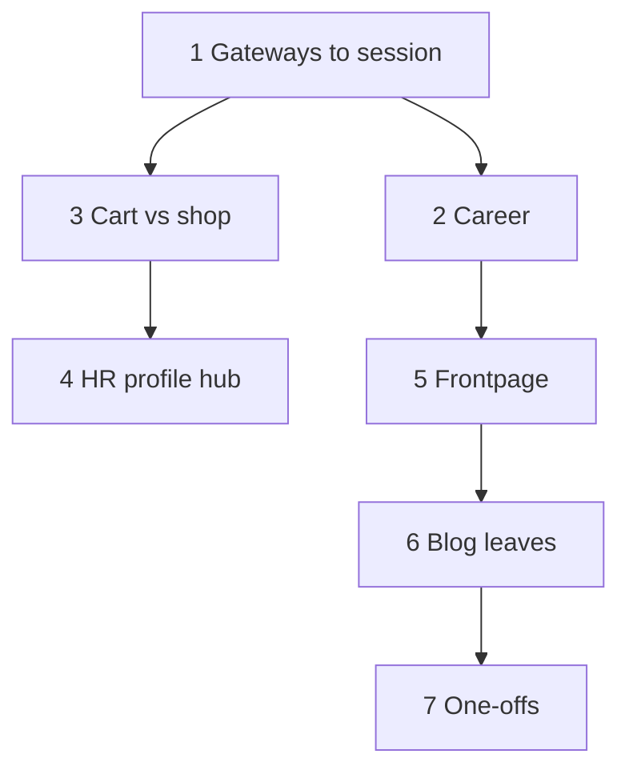

# Plan: Fix Cross-Sector Dependency Violations

This document captures the remediation plan for violations reported by `npm run check-deps` (sector cross-imports between different folders under `src/sectors/`). It aligns with the layering rules in [ComponentRelationships.md](./ComponentRelationships.md).

**Guardrails:**

- Sector folders are **islands**: no imports from sibling `src/sectors/<other>/`.
- **Shared code** → `src/common` (or lower layers).
- **Cross-sector wiring** → `src/session` (especially `session/Gateway.ts`).
- Do **not** use lazy/dynamic imports only to hide cycles.

**Verification:** After each batch, run `npm run check-deps`. Before finishing work, run `npm run build` (per `AGENTS.md`). When complete, update §2 in `ComponentRelationships.md` to note zero sector cross-deps.

---

## Baseline (as of plan authoring)

- **Layer ordering:** clean (`No layer violations found.`).
- **Sector cross-deps:** 38 edges (see `npm run check-deps` output for exact file:line list).

---

## Workstream 1 — Sector `Gateway.ts` files (`hr`, `pseudo`)

**Violations**

- `hr/Gateway.ts` imports `FvcCareerList` from **blog**, **workshop**, and **shop**.
- `pseudo/Gateway.ts` imports **shop** queue/counter views.

**Approach**

These files act as **composition roots in the wrong layer**. Move or mirror behavior into **`src/session/Gateway.ts`** (or a dedicated `session/*Gateway*.ts` helper) so session chooses which sector view to mount. Sector gateways should only reference **their own folder** plus `common` / `lib`, or be removed if session fully subsumes them.

**Why first:** Establishes the pattern for other hubs and avoids rework.

---

## Workstream 2 — Career triangle (`hr` ↔ `blog` / `shop` / `workshop`)

**Violations**

- `blog/FCareerList.ts` → `hr/FvcCareer.ts`
- `shop/FvcCareerList.ts`, `workshop/FvcCareerList.ts` → `hr/FvcCareer.ts`
- (Plus `hr/Gateway` once workstream 1 is done.)

**Approach**

- Keep **owned career domain** in one place: `FvcCareer` in **hr**, *or* move shared **contracts/types** to `src/common` if HR is not the sole owner.
- Sector-specific list chrome can stay per sector **without** importing `hr` if **session** passes factories/controllers registered at bootstrap, or if **`common`** holds shared list building blocks.

**Pragmatic shape:** `common` for career-related **types and small UI**; **hr** for `FvcCareer`; cross-sector list wiring via **session** (with workstream 1).

---

## Workstream 3 — Cart ↔ Shop

**Violations**

- `shop` → `cart`: `FvcExplorer`, `FvcMain`, `FvcOwner`, `FvcPreCheckout` (and related `FCart` / `FvcCheckout` imports).
- `cart` → `shop` (`FCartItem` → `FvcProduct`).
- `cart` → `auth` (`FvcCurrent` → `Gateway`).

**Approach**

- Extract a **cart session API** (interfaces; implementation in `common/dba` or `common/other`) so **shop** depends on **stable contracts**, not `sectors/cart/*`.
- For checkout UI: move shared flow to **`common`**, or have **session** inject cart controllers into shop pages.
- **Cart → auth:** use **session** wiring or a **`common/plt`**-style auth facade, not `sectors/auth` from `sectors/cart`.

---

## Workstream 4 — HR profile hub (`FvcUserInfo`, `FvcWeb3UserInfo`)

**Violations**

- `hr` → **blog**, **workshop**, **shop**, **community**, **messenger** (multiple imports).

**Approach**

Highest fan-out; avoid leaving direct cross-sector imports.

- **Tab/panel registry:** `session` (or a `common` registry **type**) holds entries `{ id, createPanel }` registered per sector at bootstrap; hr UI iterates registered factories only.
- Alternatively, split so hr renders **slots** filled by **session** composition.

Same theme as gateways: **hr = shell; session attaches sector bodies.**

---

## Workstream 5 — Frontpage ↔ Blog

**Violations**

- `frontpage/FvcBrief.ts`, `FvcJournal.ts` → blog loaders, lists, scroller.

**Approach**

- Move **reusable** loaders/list pieces to **`src/common`** if generic.
- If **blog-specific**, **`sectors/frontpage` must not import `sectors/blog`**: compose frontpage layout + blog widgets in **`session`** (or a frontpage path owned by session).

---

## Workstream 6 — Blog leaf violations

| File | Cross-sector | Approach |
|------|----------------|----------|
| `blog/AbWeb3New.ts` | → **hosting** (`FvcWeb3ServerRegistration`) | Shared “new post + server registration” in **common**, or registration only in **session** / **hosting** route. |
| `blog/FQuoteElement.ts` | → **shop**, **workshop** | Quote/product/project resolution: **common** types/helpers, or **session**-provided render callbacks when building blog content. |
| `blog/FCareerList.ts` | → **hr** | Covered in workstream 2. |

---

## Workstream 7 — Smaller one-offs

| From | To | Approach |
|------|-----|----------|
| `account/FvcBasic.ts` | `auth/FvcChangePassword` | Move/password UI to **account**, shared **common**, or compose from **session**. |
| `cart/FCartItem.ts` | `shop/FvcProduct` | Product display in **common**, or product view factory injected from **session**. |
| `shop/FBranch.ts` | `account/FvcAddressEditor` | Address editor in **`src/common`** or session-provided component. |
| `shop/FvcCounterMain.ts` | `auth/Gateway` | **Session** / **common** auth facade (gateway pattern). |

---

## Suggested execution order

1. Workstream 1 (session + sector gateways)
2. Workstreams 2 and 3 in parallel once 1 clarifies composition
3. Workstream 4 (registry / slots for profile hub)
4. Workstreams 5–6 (frontpage, blog)
5. Workstream 7 (one-offs)

Dependency sketch:

---

## After completion

- `npm run check-deps` exits 0 with no sector violations.
- Update **§2 Current Status** in `ComponentRelationships.md`.
